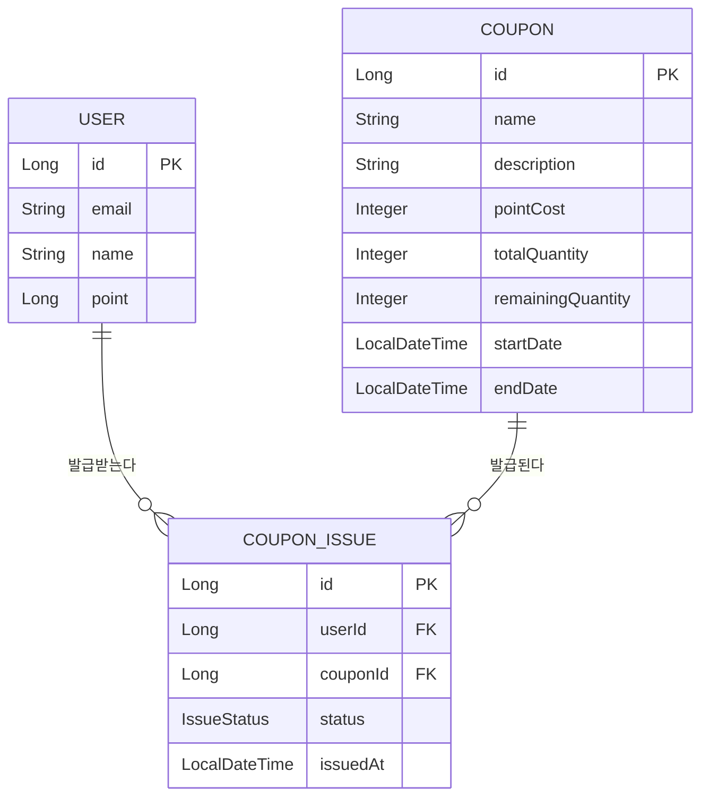

# 선착순 쿠폰 발급 시스템 ERD v1.0

## 전체 엔티티 관계도

---

## 관계 요약

| 관계 | 타입 | 설명 |
|------|------|------|
| User → CouponIssue | 1:N | 한 유저가 여러 쿠폰을 발급받을 수 있다 |
| Coupon → CouponIssue | 1:N | 한 쿠폰이 여러 유저에게 발급된다 |

> User와 Coupon은 CouponIssue를 통해 N:M 관계이나, 유니크 제약(userId + couponId)으로 같은 쿠폰은 1인 1매로 제한된다.
